[](https://classroom.github.com/a/99wpTe72)
| Name                 | NRP        | Kelas                 |
| -------------------- | ---------- | --------------------- |
| Nuril Qolbi Zam Zami | 5025221296 | Jaringan Komputer (A) |
| Alvin Zanua Putra    | 5025231064 | Jaringan Komputer (A) |

## Find your topology here!

- Link: https://drive.google.com/drive/folders/1ECQD6-cQkg0DzyflG-jSxJZaGaxg0KSU?usp=sharing

- Topology distribution for groups: https://docs.google.com/spreadsheets/d/1QKEZjixTStNbdXznOalJoJS0UQ6ed23o51pP8t8eAIM/edit?gid=1757558734#gid=1757558734

## Put your topology config image here!

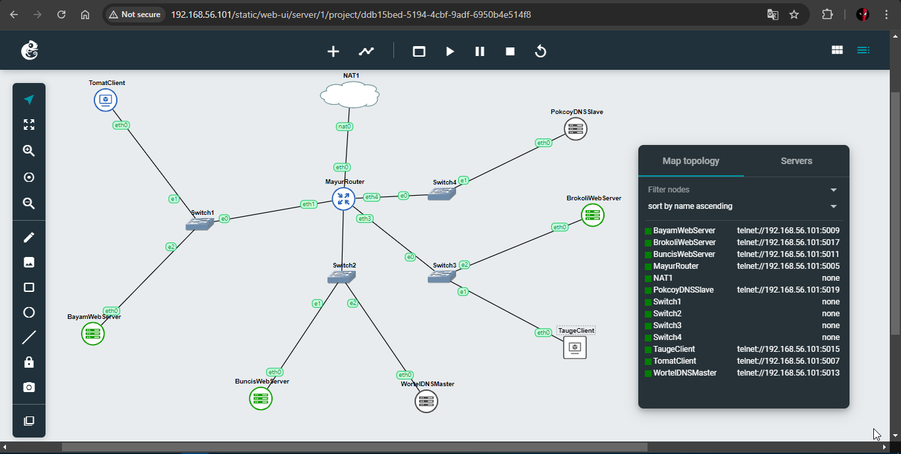

<br>

## Soal 1

> Topologi terdiri dari node Wortel yang berupa DNS Master*. Selain itu, terdapat pula node Pokcoy sebagai DNS Slave*, yang bertugas sebagai cadangan dari node Wortel.
> <br> </br>
> Selanjutnya terdapat node Tomat dan Taoge yang bekerja sebagai Client*, tiga buah Web Server* yaitu Bayam, Buncis, dan Brokoli, serta Mayur sebagai Router*. Buatlah topologi sesuai dengan pembagian topologi [di sini](https://docs.google.com/spreadsheets/d/1QKEZjixTStNbdXznOalJoJS0UQ6ed23o51pP8t8eAIM/edit?usp=sharing) dan konfigurasi topologi [di sini](https://drive.google.com/drive/folders/1ECQD6-cQkg0DzyflG-jSxJZaGaxg0KSU?usp=sharing). Pastikan bahwa setiap node dapat terhubung ke Internet.

> _The topology consists of a Wortel node which is a DNS Master*. In addition, there is also a Pokcoy node as a DNS Slave*, which serves as a backup for the Wortel node._
> <br> </br>
> _Furthermore, there are Tomat and Taoge nodes that work as Client*, three Web Servers*, namely Bayam, Buncis, and Brokoli, then finally Mayur as Router*. Make a topology according to the topology division [here](https://docs.google.com/spreadsheets/d/1QKEZjixTStNbdXznOalJoJS0UQ6ed23o51pP8t8eAIM/edit?usp=sharing) and the topology configuration [here](https://drive.google.com/drive/folders/1ECQD6-cQkg0DzyflG-jSxJZaGaxg0KSU?usp=sharing). Make sure that each node can connect to the Internet._

**Answer:**

- Screenshot

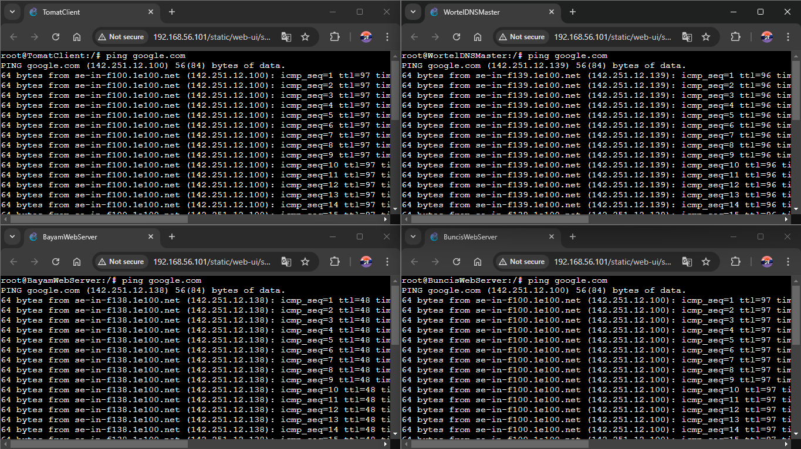

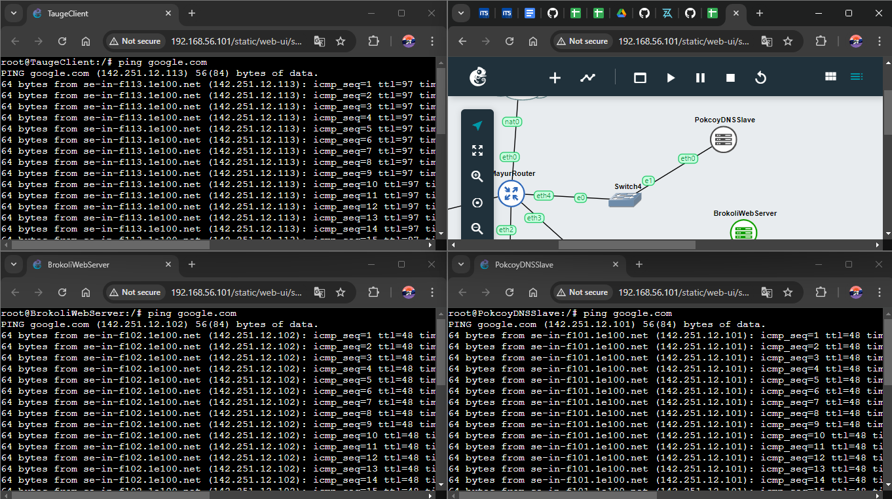


- Explanation :

  -  Configure MayorRouter
   
```bash
auto eth0
iface eth0 inet dhcp

auto eth1
iface eth1 inet static
	address 10.6.1.1
	netmask 255.255.255.0

auto eth2
iface eth2 inet static
	address 10.6.2.1
	netmask 255.255.255.0

auto eth3
iface eth3 inet static
	address 10.6.3.1
	netmask 255.255.255.0

auto eth4
iface eth4 inet static
	address 10.6.4.1
	netmask 255.255.255.0

up iptables -t nat -A POSTROUTING -o eth0 -j MASQUERADE -s 10.6.0.0/16
```

  -  Configure TomatClient 
    
```bash
auto eth0
iface eth0 inet static
	address 10.6.1.2
	netmask 255.255.255.0
	gateway 10.6.1.1

up echo nameserver 192.168.122.1 > /etc/resolv.conf
```

  -  Configure BayamWebServer
    
```bash
auto eth0
iface eth0 inet static
	address 10.6.1.3
	netmask 255.255.255.0
	gateway 10.6.1.1

up echo nameserver 192.168.122.1 > /etc/resolv.conf
```

  -  Configure BuncisWebServer
  
```bash
auto eth0
iface eth0 inet static
	address 10.6.2.2
	netmask 255.255.255.0
	gateway 10.6.2.1

up echo nameserver 192.168.122.1 > /etc/resolv.conf
```

  -  Configure WortelDNSMaster
    
```bash
auto eth0
iface eth0 inet static
	address 10.6.2.3
	netmask 255.255.255.0
	gateway 10.6.2.1

up echo nameserver 192.168.122.1 > /etc/resolv.conf
```
  -  Configure TaugeClient

```bash
auto eth0
iface eth0 inet static
	address 10.6.3.2
	netmask 255.255.255.0
	gateway 10.6.3.1

up echo nameserver 192.168.122.1 > /etc/resolv.conf
```  

  -  Configure BrokoliWebServer

```bash
auto eth0
iface eth0 inet static
	address 10.6.3.3
	netmask 255.255.255.0
	gateway 10.6.3.1

up echo nameserver 192.168.122.1 > /etc/resolv.conf
```

  -  Configure BokcoyDNSSlave
    
```bash
auto eth0
iface eth0 inet static
	address 10.6.4.2
	netmask 255.255.255.0
	gateway 10.6.4.1

up echo nameserver 192.168.122.1 > /etc/resolv.conf
```

<br>

### Kesimpulan :

`Ini adalah konfigurasi untuk setiap node-node server yang ada dan sudah bisa di ping google.com -c 3 yang artinya node sudah bisa terhubung ke server luar untuk mendownload beberapa package nanti nya.`

<br>

## Soal 2

> Tambahkan konfigurasi untuk domain bayam.yyy.com yang mengarah ke IP node Bayam di DNS Master. Dengan cara yang sama, buat konfigurasi domain brokoli.yyy.com yang mengarah ke IP node Brokoli dan domain buncis.yyy.com yang mengarah ke IP node Buncis. Simpan semua konfigurasi dalam folder Jarkom. Selama pengerjaan soal, ubah yyy menjadi kode kelompok masing-masing (contoh: A02).
> <br> </br>
> Jangan lupa update konfigurasi kedua client agar dapat berkomunikasi dengan semua domain tersebut.


> _Add a configuration for bayam.yyy.com domain that points to the Bayam node IP in the DNS Master. In the same way, create a brokoli.yyy.com domain configuration that points to the Brokoli node IP and a buncis.yyy.com domain that points to the Buncis node IP. Save all configurations in a folder called Jarkom. For this practicum, substitute yyy with the code of each group (ex: A02).
> <br> </br> 
> Don't forget to update the configuration of both clients so that they can communicate with the domains._

**Answer:**

- Screenshot

  Di WortelDNSMaster :

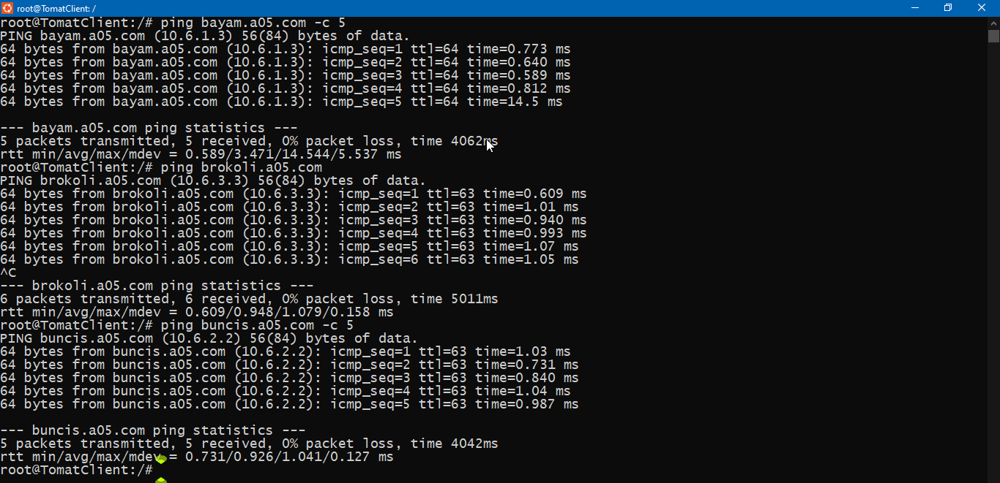


- Explanation

  `Untuk yang pertama siapkan dulu setup awal untuk menginstallasi 
  package dan membuat file yang dibutuhkan untuk konfigurasi DNS nya`

  <br>

  `Buat zone untuk masing masing node web server. Lakukan ping  
  untuk mengecek. Jangan lupa ganti nameserver ke WortelDNSMaster  
  di client yaitu nameserver 10.6.2.3`

**WortelDNSMaster**

```bash
echo 'nameserver 192.168.122.1' >/etc/resolv.conf
apt-get update
apt-get install bind9 -y
apt-get install dnsutils

cp /etc/bind/db.local /etc/bind/jarkom/bayam.a05.com
cp /etc/bind/db.local /etc/bind/jarkom/brokoli.a05.com
cp /etc/bind/db.local /etc/bind/jarkom/buncis.a05.com
cp /etc/bind/db.local /etc/bind/jarkom/1.6.10.in-addr.arpa
cp /etc/bind/db.local /etc/bind/jarkom/2.6.10.in-addr.arpa
cp /etc/bind/db.local /etc/bind/jarkom/3.6.10.in-addr.arpa
mkdir -p /etc/bind/jarkom
mkdir /etc/bind/vitamin
cp /etc/bind/db.local /etc/bind/vitamin/vitamin.brokoli.a05.com

cp /etc/bind/db.local /etc/bind/jarkom/pokcoy.a05.com
```

`Buat folder jarkom di dalam etc/bind kemudian cp file db.local dari folder /etc/bind ke folder jarkom dengan nama bayam.a05.com, brokoli.a05.com, dan buncis.a05.com. Isi konfig tiap-tiap file sesuai di bawah ini :`

**WortelDNSMaster**

```bash
echo 'zone "bayam.a05.com" {
  type master;
  file "/etc/bind/jarkom/bayam.a05.com";
};

zone "brokoli.a05.com" {
    type master;
    file "/etc/bind/jarkom/brokoli.a05.com";
};

zone "buncis.a05.com" {
    type master;
    file "/etc/bind/jarkom/buncis.a05.com";
}; ' >/etc/bind/named.conf.local

echo '
$TTL    604800
@       IN      SOA     bayam.a05.com. root.bayam.a05.com. (
                          2         ; Serial
                    604800         ; Refresh
                      86400         ; Retry
                    2419200         ; Expire
                    604800 )       ; Negative Cache TTL
;
@       IN      NS      bayam.a05.com.
@       IN      A       10.6.1.3 ' >/etc/bind/jarkom/bayam.a05.com

echo ' 
$TTL    604800
@       IN      SOA     brokoli.a05.com. root.brokoli.a05.com. (
                          2         ; Serial
                    604800         ; Refresh
                      86400         ; Retry
                    2419200         ; Expire
                    604800 )       ; Negative Cache TTL
;
@       IN      NS      brokoli.a05.com.
@       IN      A       10.6.3.3 ' >/etc/bind/jarkom/brokoli.a05.com

echo '
$TTL    604800
@       IN      SOA     buncis.a05.com. root.buncis.a05.com. (
                          2         ; Serial
                    604800         ; Refresh
                      86400         ; Retry
                    2419200         ; Expire
                    604800 )       ; Negative Cache TTL
;
@       IN      NS      buncis.a05.com.
@       IN      A       10.6.2.2 ' >/etc/bind/jarkom/buncis.a05.com

service bind9 restart
```

`Restart bind9 service bind9 restart kemudian pindah ke client, gunakan nano /etc/resolv.conf untuk mengganti tujuan IP ke DNS MASTER. Jalankan ping bayam.a05.com, brokoli.a05.com, dan ping buncis.a05.com.`

Masuk dan Ubah nameserver di Client terlebih dahulu

**Client**

```bash
echo '
nameserver 10.6.2.3 
nameserver 192.168.122.1' > /etc/resolv.conf

ping bayam.a05.com -c 3
ping brokoli.a05.com -c 3
ping buncis.a05.com -c 3
```


<br>

## Soal 3

> Tambahkan domain alias berupa www.bayam.yyy.com pada alamat bayam.yyy.com dan www.brokoli.yyy.com pada alamat brokoli.yyy.com.

> _Add a domain alias in the form of www.bayam.yyy.com to the bayam.yyy.com address and www.brokoli.yyy.com to the brokoli.yyy.com address._

**Answer:**

- Screenshot

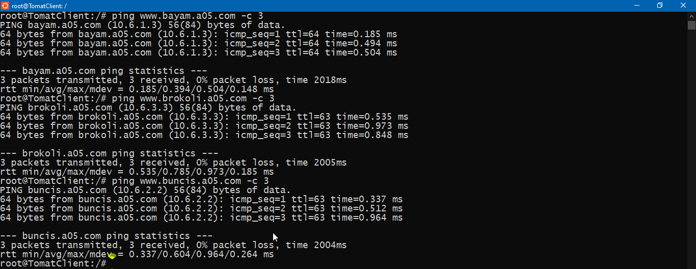


- Explanation

`Tambahkan konfigurasi www IN CNAME pada masing masing file di dalam /etc/bind/jarkom/ di DNS Master (Wortel). Jangan lupa ganti nameserver client ke WortelDNSMaster`

**WortelDNSMaster**

```bash 
www     IN      CNAME   brokoli.a05.com.
www     IN      CNAME   bayam.a05.com.
www     IN      CNAME   buncis.a05.com. 
```

`Kemuadian restart service bind9 restart lalu pergi ke client`

**Client**

```bash
ping bayam.a05.com -c 3
ping brokoli.a05.com -c 3
ping buncis.a05.com -c 3
```


<br>

## Soal 4

> Tambahkan record reverse domain untuk domain brokoli.yyy.com dan buncis.yyy.com.

> _Add a reverse domain record for brokoli.yyy.com and buncis.yyy.com domains._

**Answer:**

- Screenshot

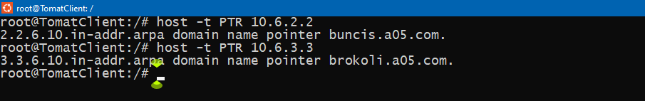


- Explanation
  
  `Tambahkan konfigurasi pada file `/etc/bind/named.conf.local` di DNS 
  Master (Wortel) untuk record reverse yaitu tambahkan zone in-
  addr.arpa. Lalu kita beri PTR untuk masing masing node, selalu cek 
  berkala nameserver di client bahwa nameserver nya GNSMaster sudah 
  tertera.`
  
**WortelDNSMaster**

```bash
echo '
zone "1.6.10.in-addr.arpa" {
    type master;
    file "/etc/bind/jarkom/1.6.10.in-addr.arpa";
};

zone "2.6.10.in-addr.arpa" {
    type master;
    file "/etc/bind/jarkom/2.6.10.in-addr.arpa";
};

zone "3.6.10.in-addr.arpa" {
    type master;
    file "/etc/bind/jarkom/3.6.10.in-addr.arpa";
};
' >>/etc/bind/named.conf.local
```
`Jangan lupa restart service bind9 restart lalu lakukan pengujian di client. Pastikan nameserver nya masih punya GNSMaster`

```bash
host -t PTR 10.6.3.3
host -t PTR 10.6.2.2
```

<br>

## Soal 5

> Ubah record SOA dari domain bayam.yyy.com sesuai dengan ketentuan berikut:
> - Lama waktu server slave menunggu untuk mengecek salinan baru server master adalah sebesar 2 jam.
> - Field yang mengatur revisi file zona ini diubah menjadi tanggal awal praktikum (format YYYYMMDD) kemudian diikuti dengan nomor kelompok (contoh untuk kelompok A02 maka nomornya 02).
> - Lamanya waktu server harus menunggu untuk meminta pembaruan lagi dari nameserver master yang tidak responsif sebesar 30 menit.
> - Lama waktu nama domain di-cache secara lokal sebelum kadaluarsa dan kembali ke nameserver otoritatif untuk informasi terbaru sebesar 12 jam.
> - Jika server slave tidak mendapatkan respons dari server master dalam waktu 2 minggu, server tersebut harus berhenti merespons kueri untuk zona tersebut.

> _Change the SOA record of the bayam.yyy.com domain according to the following conditions:_
> - The length of time the slave server waits to check for a new revision of the master server is 2 hours.
> - The field that regulates the revision of this zone file is changed to the start date of the practicum (YYYYMMDD format) then followed by the group number (ex: for A02 the group number would be 02).
> - The length of time the server has to wait to request another update from an unresponsive master nameserver is 30 minutes.
> - The length of time a domain name is cached locally before it expires and returns to an authoritative nameserver for up-to-date information is 12 hours.
> - If the slave server does not get a response from the master server within 2 weeks, it must stop responding to queries for that zone.

**Answer:**

- Screenshot

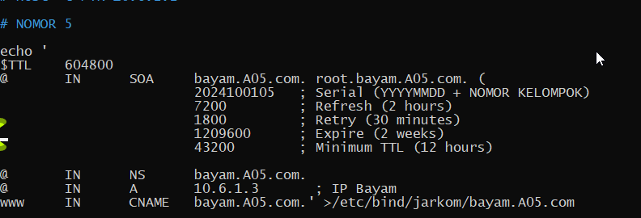

- Explanation

`Membuat File Zona @ IN SOAroot.bayam.a05.com. (...):  mendefinisikan record Start of Authority (SOA) untuk zona bayam.a05.com. Ini menunjukkan bahwa bayam.a05.com adalah nameserver otoritatif untuk domain ini`


**WortelDNSMaster**

```bash
echo '
$TTL    604800
@       IN      SOA     bayam.a05.com. root.bayam.a05.com. (
                        2024100105   ; Serial (YYYYMMDD + NOMOR KELOMPOK)
                        7200         ; Refresh (2 hours)
                        1800         ; Retry (30 minutes)
                        1209600      ; Expire (2 weeks)
                        43200        ; Minimum TTL (12 hours)

@       IN      NS      bayam.A05.com.
@       IN      A       10.6.1.3       ; IP Bayam
www     IN      CNAME   bayam.A05.com.' >/etc/bind/jarkom/bayam.a05.com
```

`Untuk mengecek rocord SOA dalam bayam apakah sudah berubah apa belum gunakan command cat di GNS Master`

**WortelDNSMaster**
```bash
cat etc/bind/jarkom/bayam.a05.com 
```


<br>

## Soal 6

> Untuk menangani request yang berlebih dari client ke ketiga alamat yang tadi dibuat, konfigurasikan node Pokcoy sebagai DNS Slave yang bekerja untuk DNS Master Wortel.

> _To handle excess requests from the client to the three addresses created, configure the Pokcoy node as the DNS Slave that works for Wortel DNS Master._

**Answer:**

- Screenshot

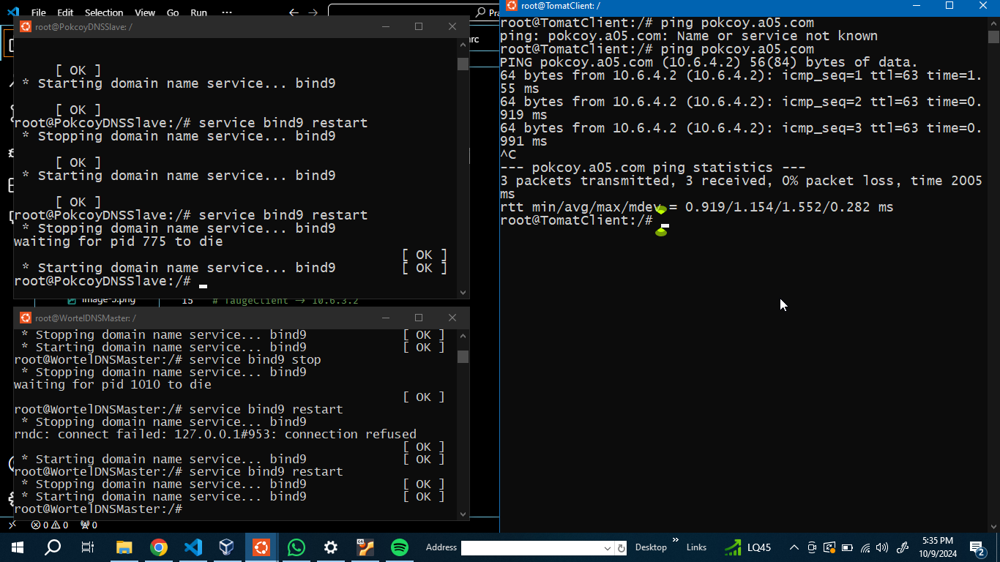

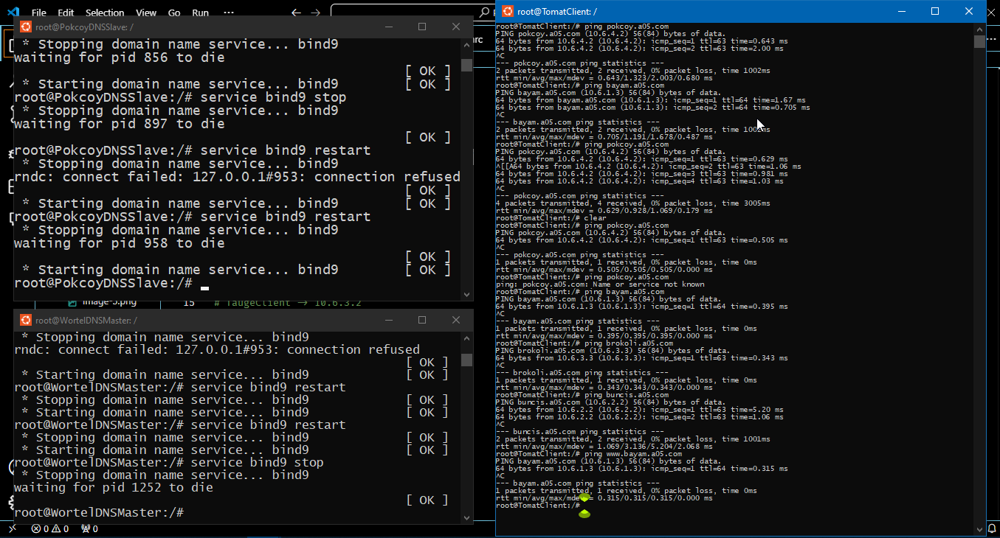

- Explanation

`Disini tambahkan zone pokcoy yang akan digunakan untuk membuat DNS Slave. Kita juga harus mengkonfigurasi root pada node PokcoyDNSSlave yaitu dengan menambahkan`

```bash
type master;
notify yes;
also-notify { 10.6.4.2; };
allow-transfer { 10.6.4.2; }; 
```

`yang berarti Pokcoy adalah DNSMaster cadangan.Setelah itu lakukan ping untuk mengecek. Jangan lupa matikan service bind9 di DNS Master dan nyalakan service bind9 di DNS Slave dan pastikan nameserver DNSMaster tercantum di Slave.`

**WortelDNSMaster**

```bash
echo -e '
zone "1.6.10.in-addr.arpa" {
        type master;
        file "/etc/bind/jarkom/1.6.10.in-addr.arpa";
};
zone "2.6.10.in-addr.arpa" {
        type master;
        file "/etc/bind/jarkom/2.6.10.in-addr.arpa";
};
zone "3.6.10.in-addr.arpa" {
        type master;
        file "/etc/bind/jarkom/3.6.10.in-addr.arpa";
};

zone "bayam.a05.com" {
    type master;
    notify yes;
    also-notify { 10.6.4.2; };
    allow-transfer { 10.6.4.2; };
    file "/etc/bind/jarkom/bayam.a05.com";
};

zone "brokoli.a05.com" {
    type master;
    notify yes;
    also-notify { 10.6.4.2; };
    allow-transfer { 10.6.4.2; };
    file "/etc/bind/jarkom/brokoli.a05.com";
};

zone "buncis.a05.com" {
    type master;
    notify yes;
    also-notify { 10.6.4.2; };
    allow-transfer { 10.6.4.2; };
    file "/etc/bind/jarkom/buncis.a05.com";
};

zone "pokcoy.a05.com" {
    type master;
    notify yes;
    also-notify { 10.6.4.2; };
    allow-transfer { 10.6.4.2; };
    file "/etc/bind/jarkom/pokcoy.a05.com";
};

' >/etc/bind/named.conf.local

echo '
;
; BIND data file for local loopback interface
;
$TTL    604800
@       IN      SOA     pokcoy.a05.com. root.pokcoy.a05.com. (
                        2024100105    ; Serial
                         7200         ; Refresh
                          1800        ; Retry
                        1209600       ; Expire
                         43200)       ; Negative Cache TTL;
;
@       IN      NS      pokcoy.a05.com.
@       IN      A       10.6.4.2       ; IP Pokcoy
www     IN      CNAME   pokcoy.a05.com. ;
' > /etc/bind/jarkom/pokcoy.a05.com

service bind9 stop
```

<br>
<br>

**PokcoyDNSSlave**

```bash
# NOMOR 6

echo '
nameserver 192.168.122.1
nameserver 10.6.2.3 ' > /etc/resolv.conf

apt-get update
apt-get install bind9 -y

mkdir -p /etc/bind/vitamin
cp /etc/bind/db.local /etc/bind/vitamin/vitamin.brokoli.a05.com
cp /etc/bind/db.local /etc/bind/vitamin/k1.vitamin.brokoli.a05.com


echo ' 
zone "bayam.a05.com" {
    type slave;
    masters { 10.6.2.3; };
    file "/var/lib/bind/bayam.a05.com";
};

zone "brokoli.a05.com" {
    type slave;
    masters { 10.6.2.3; };
    file "/var/lib/bind/brokoli.a05.com";
};

zone "buncis.a05.com" {
    type slave;
    masters { 10.6.2.3; };
    file "/var/lib/bind/buncis.a05.com";
};


zone "pokcoy.a05.com" {
    type slave;
    masters { 10.6.2.3; }; 
    file "/var/lib/bind/pokcoy.a05.com";
};

' > /etc/bind/named.conf.local

service bind9 restart
```

**Client**

```bash
ping pokcoy.a05.com -c 3
ping bayam.a05.com -c 3
ping brokoli.a05.com -c 3
ping buncis.a05.com -c 3
```


<br>

## Soal 7

> Karena membutuhkan tempat untuk menyimpan resep brokoli, buatlah subdomain berupa vitamin.brokoli.yyy.com dengan alias www.vitamin.brokoli.yyy.com dengan mendelegasikannya dari Wortel ke Pokcoy dengan alamat IP menuju Brokoli yang diatur di folder Vitamin.

> _Since we need a place to store Brokoli recipes, create a subdomain in the form of vitamin.brokoli.yyy.com with an alias of www.vitamin.brokoli.yyy.com by delegating it from Wortel to Pokcoy with an ip to the Brokoli node in a folder called Vitamin._

**Answer:**

- Screenshot

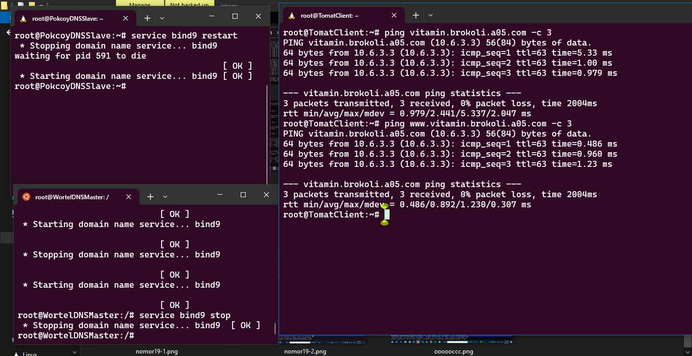

- Explanation

`Disini tinggal menambahkan sedikit perubahan pada brokoli.a05.com tambahkan dibawah record soa nya`

**WortelDNSMaster**
```bash
vitamin IN      A       10.6.4.2       ; IP Pokcoy
ns1     IN      A       10.6.4.2       ; NS record pointing to ns1
vitamin IN      NS      ns1            ; Nameserver untuk vitamin.brokoli.a05.com
```

```Kurang lebih seperti ini : `

**WortelDNSMaster**
```bash
echo '
$TTL    604800
@       IN      SOA     brokoli.a05.com. root.brokoli.a05.com. (
                        2024100106    ; Serial (update ini setiap kali ada perubahan)
                         7200         ; Refresh
                          1800        ; Retry
                        1209600       ; Expire
                         43200 )      ; Negative Cache TTL
;
@       IN      NS      brokoli.a05.com.
@       IN      A       10.6.3.3       ; IP Brokoli

www     IN      CNAME   brokoli.a05.com.  ; Alias untuk brokoli.a05.com

; dibawah ini _____________________________________________
vitamin IN      A       10.6.4.2       ; IP Pokcoy
ns1     IN      A       10.6.4.2       ; NS record pointing to ns1
vitamin IN      NS      ns1            ; Nameserver untuk vitamin.brokoli.a05.com
; _____________________________________________________________
' > /etc/bind/jarkom/brokoli.a05.com


echo "options {
    directory \"/var/cache/bind\";
    allow-query { any; };
    auth-nxdomain no;
    listen-on-v6 { any; };
};" > /etc/bind/named.conf.options


echo '
zone "vitamin.brokoli.a05.com" {
    type master;
    notify yes;
    also-notify { 10.6.4.2; };
    allow-transfer { 10.6.4.2; };
    file "/etc/bind/vitamin/vitamin.brokoli.a05.com";
};
' >> /etc/bind/named.conf.local
```


**PokcoyDNSSlave**
```bash
echo -e '
zone "vitamin.brokoli.a05.com" {
    type master;
    file "/etc/bind/vitamin/vitamin.brokoli.a05.com";
};
' >> /etc/bind/named.conf.local


echo '
;
; BIND data file for vitamin.brokoli.a05.com
;
$TTL    604800
@       IN      SOA     vitamin.brokoli.a05.com. root.vitamin.brokoli.a05.com. (
                        2023101001      ; Serial
                         604800         ; Refresh
                          86400         ; Retry
                        2419200         ; Expire
                         604800 )       ; Negative Cache TTL
;
@       IN      NS      vitamin.brokoli.a05.com.
@       IN      A       10.6.3.3       ; IP Brokoli
www     IN      CNAME   vitamin.brokoli.a05.com.
' > /etc/bind/vitamin/vitamin.brokoli.a05.com


echo "options {
    directory \"/var/cache/bind\";
    allow-query { any; };
    auth-nxdomain no;
    listen-on-v6 { any; };
};" > /etc/bind/named.conf.options

service bind9 restart
```

`Lakukan pegujian di client pastikan ada nameserver pokcoy juga di dalam Client : `

**Client**

```bash
echo -e '
nameserver 10.6.2.3 
nameserver 10.6.4.2 
nameserver 192.168.122.1
' > /etc/resolv.conf

ping vitamin.brokoli.a05.com -c 3
ping www.vitamin.brokoli.a05.com -c 3
```

<br>

## Soal 8

> Buatlah subdomain khusus untuk kandungan brokoli dengan akses k1.vitamin.brokoli.yyy.com dengan alias www.k1.vitamin.brokoli.yyy.com yang mengarah ke IP brokoli dan diatur di folder k1.  

> _Create a special subdomain for Brokoli content called k1.vitamin.brokoli.yyy.com with an alias called www.k1.vitamin.brokoli.yyy.com that point to Brokoli node and are organized in a folder called k1._

**Answer:**

- Screenshot

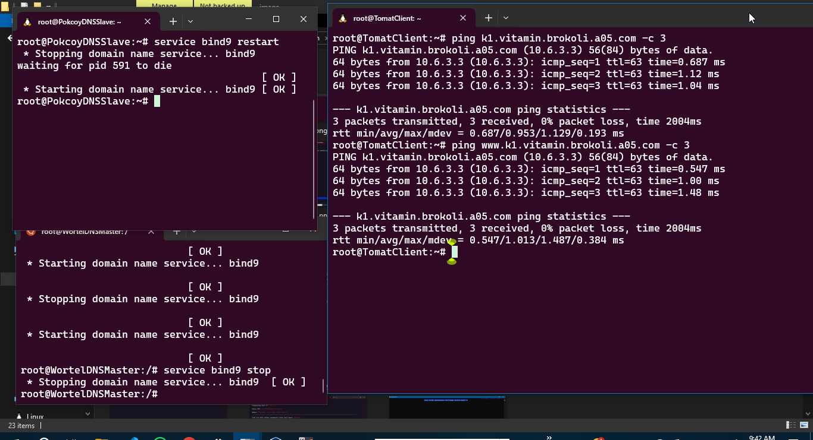

- Explanation

`Disini kita tinggal menambah sedikit perubahan pada DNS Slave yaitu menambahkan k1 sebagai subdomain da menyimpan ke dalam folder k1 yang sudah dibuat atau di "cp" di awal tadi.`

**PokcoyDNSSlave**

```bash
k1      IN      A       10.6.3.3
www.k1  IN      CNAME   k1.vitamin.brokoli.a05.com.
```

`Kurang lebih seperti ini untuk semua konfigurasi nya : `

**PokcoyDNSSlave**

```bash
echo '
$TTL    604800
@       IN      SOA     vitamin.brokoli.a05.com. root.vitamin.brokoli.a05.com. (
                        2023101001      ; Serial
                         604800         ; Refresh
                          86400         ; Retry
                        2419200         ; Expire
                         604800 )       ; Negative Cache TTL
;
@       IN      NS      vitamin.brokoli.a05.com.
@       IN      A       10.6.3.3       ; IP Brokoli
www     IN      CNAME   vitamin.brokoli.a05.com.
k1      IN      A       10.6.3.3
www.k1  IN      CNAME   k1.vitamin.brokoli.a05.com.
' > /etc/bind/vitamin/vitamin.brokoli.a05.com

service bind9 restart
```

`Untuk testing di client pastika lagi ada nameserver pokcoy di dalam resolv.config nya :`

**Client**

```bash
echo -e '
nameserver 10.6.4.2
nameserver 10.6.2.3
nameserver 192.168.122.1
' > /etc/resolv.conf

ping k1.vitamin.brokoli.a05.com -c  3
ping www.k1.vitamin.brokoli.a05.com -c

```


<br>

## Soal 9

> Bayam, Brokoli, dan Buncis masing-masing berfungsi sebagai web server nginx yang menyajikan resep khusus untuk jenis sayuran yang mereka tangani. Untuk mengaktifkan web server pada masing-masing worker, lakukan deployment website menggunakan sumber yang tersedia di sayur_webserver_nginx. Tambahkan konfigurasi untuk log error ke file /var/log/nginx/error.log dan log access ke file /var/log/nginx/access.log.

> _Bayam, Brokoli, and Buncis each function as nginx web servers that serve special recipes for the type of vegetables they handle. To activate the web server on each worker, do the deployment using the resources available in sayur_webserver_nginx. Add configuration for error log to the file /var/log/nginx/error.log and access log to the file /var/log/nginx/access.log._

**Answer:**

- Screenshot

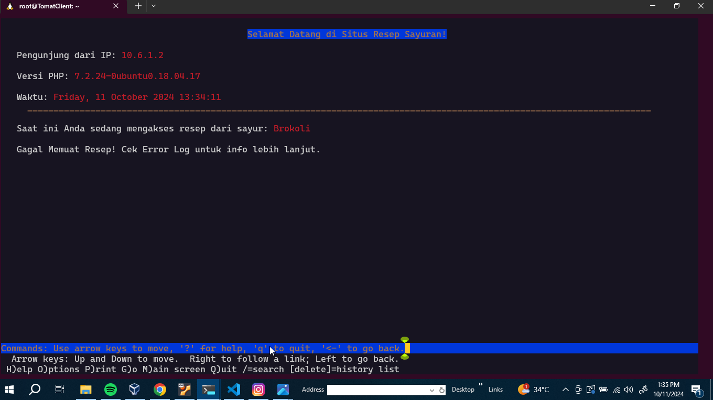

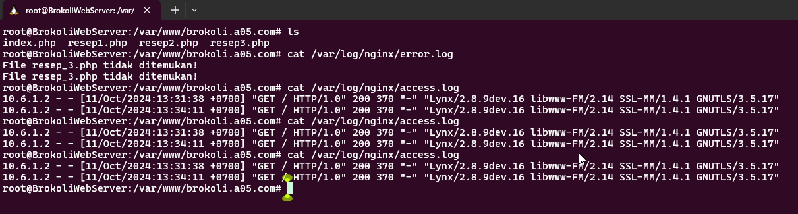

- Explanation

`Untuk menampilkan pesan error yang sudah ditampilkan saat mengakses website ataupun history akses konfigurasii penginstalan dulu untuk php dan apache beserta nginx, lynx dan lain lain, untuk di client hanya butuh lynx untuk mengakses website PHP dan Apache2, untuk konfigurasi nya lakukan di Webserver disini menggunakan brokoli terlebih dahulu dan mengakses web di dalamnya.`

#### CATATAN :
`UNTUK BROKOLI INI DI NOMER 9 SAMPAI 20 tidak bisa langsung bashrc, harus dijalankan satu persatu karena ada kombinasi restart dan stop service di DNS maupun webserver harus dilakukan setiap saat agar website dapat diakses.`

**BrokoliWebServer**

```bash
echo -e '
nameserver 10.6.2.3 
nameserver 10.6.4.2 
nameserver 192.168.122.1
' > /etc/resolv.conf

apt-get update                                                             
apt-get install nginx -y                                                 
apt-get install lynx -y
apt-get install apache2 -y
apt-get install php -y

apt-get install unzip -y
apt-get install php7.2-fpm  -y

wget --no-check-certificate --content-disposition "https://docs.google.com/uc?export=download&id=1tFDk7pKRQLd3BMUcyvfAfEL-drvIxdSl"
unzip sayur_webserver_nginx

# -- cek (php p memakai 7.2) memastikan jalan atau tidaknya server

service nginx status
service php7.2-fpm status

# jangan lupa  

service nginx start
service php7.2-fpm start

# -- contoh pake brokoli

cd /etc/nginx/sites-available/
nano brokoli.a05.com

server {

	listen 80;

	root /var/www/brokoli.a05.com;

	index index.php index.html index.htm;
	server_name brokoli.a05.com www.brokoli.a05.com;

	location / {
			try_files $uri $uri/ /index.php?$query_string;
	}

	# pass PHP scripts to FastCGI server
	location ~ \.php$ {
	include snippets/fastcgi-php.conf;
	fastcgi_pass unix:/var/run/php/php7.2-fpm.sock;
	}

location ~ /\.ht {
			deny all;
	}

	error_log /var/log/nginx/error.log;
	access_log /var/log/nginx/access.log;
}

# mencloning istilahnya available sebagai backend dan enabled sebagai frontend yang ditampilkan terlebih dahulu ketika user mengakses 
ln -s /etc/nginx/sites-available/brokoli.a05.com /etc/nginx/sites-enabled/brokoli.a05.com

# buat folder untuk folder tempat website
mkdir -p /var/www/brokoli.a05.com

# balik ke root lalu pindah ke folder root yang sudah dibuat 
cd

mv sayur_webserver_nginx/* /var/www/brokoli.a05.com

# cek
cd /var/www/brokoli.a05.com
ls

# -- spy resepnya muncul, harus ganti hostname

cd

hostname Brokoli

service nginx restart
```

`Testing untuk website nya di cleint pastikan sudah menginstall beberapa package yaitu lynx dan nginx , seharusnya dia akan memunculkan pesan bahwa web sudah dikases namun ada error karena file resepnya tidak ada : `

**Client**

```bash
apt-get update                                                             
apt-get install nginx -y                                                 
apt-get install lynx -y

lynx brokoli.a05.com

```

`Cek history nya di brokoli/webserver brokoli balik ke brokoliWebserver muncul error kode 307 karena tidak bisa diakses`

**BrokoliWebServer**

```bash
cat /var/log/nginx/error.log
cat /var/log/nginx/access.log
```

<br>

## Soal 10

> Pada masing masing worker nginx, akan terdapat beberapa hal yang perlu diperbaiki pada resource yang diberikan untuk bisa menampilkan resep saat halaman dimuat. Analisis kesalahan yang ada di resource melalui file /var/log/nginx/error.log dan perbaiki hingga halaman bisa menampilkan resep sesuai dengan worker nya.

> _On each nginx worker, there will be several things that need to be fixed in the resources provided to be able to display recipes when the page is loaded. Analyze the errors in the resource through the /var/log/nginx/error.log file and fix it until the page can display recipes according to its worker._

**Answer:**

- Screenshot

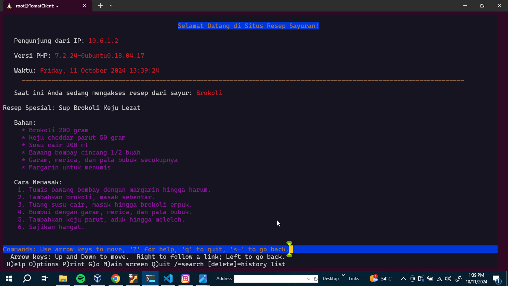

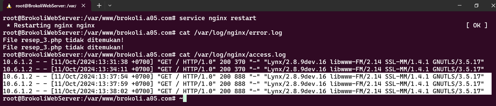

- Explanation

`Nah disinilah baru bisa kita mengakses bahan resep dari brokoli yang mana resep brokoli yaitu Kesalahan terdapat pada penulisan masing-masing resep_$.php, di mana file aslinya bernama resep$.php, Masuk ke Directory Root :

```bash
cd /var/www/brokoli.a05.com
mv resep3.php resep_3.php
service nginx restart
```


`Testing untuk website nya di cleint pastikan sudah menginstall beberapa package yaitu lynx dan nginx , seharusnya dia akan memunculkan pesan bahwa web sudah dikases dan muncul resep brokoli.`

**Client**

```bash
lynx brokoli.a05.com
```

`Cek history nya di brokoli/webserver brokoli balik ke brokoliWebserver muncul success kode 888 karena sudah bisa diakses resep nya`

**BrokoliWebServer**

```bash
cat /var/log/nginx/error.log
cat /var/log/nginx/access.log
```


<br>

## Soal 11

> Setelah website berhasil dideploy pada masing-masing worker (Bayam, Brokoli, dan Buncis) dan halaman dapat menampilkan resep sayuran yang sesuai,  buatlah custom access log ke file /var/log/nginx/access.log di masing-masing web server worker menggunakan format log tertentu seperti di bawah:
> - Tanggal dan waktu akses dalam format sr log.
Nama worker yang sedang dilayani (misalnya: Bayam, Brokoli, atau Buncis).
> - Alamat IP klien yang mengakses website.
> - Metode HTTP dan URI yang diakses oleh klien.
> - Status respons HTTP yang diberikan oleh server.
> - Jumlah byte yang dikirimkan dalam respons.
> - Waktu yang dihabiskan oleh server untuk menangani permintaan.
> <br> </br>
> Contoh format log yang sesuai: 
[01/Oct/2024:11:30:45 +0000] Jarkom Node Bayam Access from 192.168.1.15 using method "GET /resep/bayam HTTP/1.1" returned stat


> _After successfully deploying the website on each worker (Bayam, Brokoli, and Buncis) and ensuring the pages display the appropriate vegetable recipes, create a custom access log file at /var/log/nginx/access.log on each web server worker using a specific log format as described below:_
> - _Access date and time in srd log format._
> - _Name of the worker serving the request (e.g., Bayam, Brokoli, or Buncis)._
> - _Client IP address accessing the website._
> - _HTTP method and URI accessed by the client._
> - _HTTP response status provided by the server.__
> - _Number of bytes sent in the response.
> - _Time taken by the server to handle the request._
> <br> </br>
> _Example of the appropriate log format:
[01/Oct/2024:11:30:45 +0000] Jarkom Node Bayam Access from 192.168.1.15 using method "GET /resep/bayam HTTP/1.1" returned status 200 with 2567 bytes sent in 0.038 seconds_


**Answer:**

- Screenshot

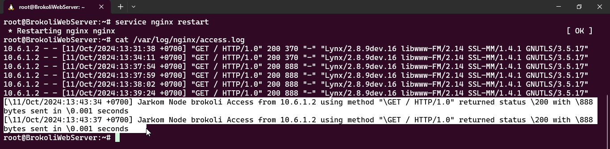

- Explanation

`Untuk merubah format, Buka file konfigurasi di file /etc/nginx/nginx.conf :  `

**BrokoliWebServer**

```bash
nano /etc/nginx/nginx.conf

# masukin ini :

user www-data;
worker_processes auto;
pid /run/nginx.pid;
include /etc/nginx/modules-enabled/*.conf;

events {
    worker_connections 768;
}

http {
    map $host $worker_name {
        default "Unknown";  # Jika hostname tidak dikenali
        "10.6.1.3" "Bayam";
        "10.6.2.2" "Buncis";
        "10.6.3.3" "Brokoli";
    }

    # log_format custom_log '[\$time_iso8601] Jarkom Node $hostname Access from \$remote_addr using method "\$request" returned status \$status';
    log_format custom_log '[\$time_local] Jarkom Node $hostname Access from $remote_addr using method "\$request" returned status \$status with \$body_bytes_sent bytes sent in \$request_time seconds';


    ## Basic Settings
    sendfile on;
    tcp_nopush on;
    tcp_nodelay on;
    keepalive_timeout 65;
    types_hash_max_size 2048;

    include /etc/nginx/mime.types;
    default_type application/octet-stream;

    ## SSL Settings
    ssl_protocols TLSv1 TLSv1.1 TLSv1.2; # Dropping SSLv3, ref: POODLE
    ssl_prefer_server_ciphers on;

    ## Logging Settings
    access_log /var/log/nginx/access.log custom_log;
    error_log /var/log/nginx/error.log;

    ## Gzip Settings
    gzip on;

    ## Virtual Host Configs
    include /etc/nginx/conf.d/*.conf;
    include /etc/nginx/sites-enabled/*;

    # Konfigurasi Server
    server {
        listen 80;  # Ganti dengan port yang sesuai
        server_name 10.6.1.3 10.6.2.2 10.6.3.3;  # Nama server untuk IP yang digunakan

        location / {
            # Logika pemrosesan untuk masing-masing worker_name jika diperlukan
            # Misalnya, bisa menambahkan pengaturan proxy_pass di sini
        }
    }
}
```

`Lalu validasi serverna,e dan juga root nya di dalam file /etc/nginx/sites-available/brokoli.a05.com : `

**BrokoliWebServer**

```bash
nano /etc/nginx/sites-available/brokoli.a05.com

# masukin ini :

server {

        listen 80;

        root /var/www/brokoli.a05.com;

		index index.php resep_1.php resep_2.php resep_3.php;
        # index index.php index.html index.htm;
        server_name brokoli.a05.com www.brokoli.a05.com;

		access_log /var/log/nginx/access.log custom_log;
        error_log /var/log/nginx/error.log;

        location / {
                        # try_files $uri $uri/ /index.php?$query_string;
						try_files $uri $uri/ =404;
        }

        # pass PHP scripts to FastCGI server
        location ~ \.php$ {
        include snippets/fastcgi-php.conf;
        fastcgi_pass unix:/var/run/php/php7.2-fpm.sock;
        }

location ~ /\.ht {
                        deny all;
        }

        # error_log /var/log/nginx/error.log;
        # access_log /var/log/nginx/access.log;
}

servie nginx restart
```

`Lakukan pengetesan di Client : `

**Client** 

```bash
# coba lynx lagi di client
lynx brokoli.a05.com

# cek di brokoli lagi setelah akses
cat /var/log/nginx/access.log
```


<br>

## Soal 12

> Informasi vitamin pada sayur brokoli akan ditampilkan pada subdomain vitamin.brokoli.yyy.com di node brokoli, buatlah DocumentRoot yang disimpan pada /var/www/vitamin.brokoli.yyy. Konfigurasikan webserver dengan nama server vitamin.brokoli.yyy.com dan server alias www.vitamin.brokoli.yyy.com. Lakukan konfigurasi Apache Web Server pada Brokoli dengan menggunakan sumber yang tersedia di [sini](https://docs.google.com/uc?export=download&id=1QbGkKXo3jt4c68AdVAkl1hD4LolTUPg2).

> _For information on vitamins in brokoli will be displayed on the vitamin.brokoli.yyy.com subdomain on the brokoli node, create a DocumentRoot stored in /var/www/vitamin.brokoli.yyy. Configure the web server with the server name vitamin.brokoli.yyy.com and server alias www.vitamin.brokoli.yyy.com. Configure the Apache Web Server on Brokoli using [this resource](https://docs.google.com/uc?export=download&id=1QbGkKXo3jt4c68AdVAkl1hD4LolTUPg2)._

**Answer:**

- Screenshot

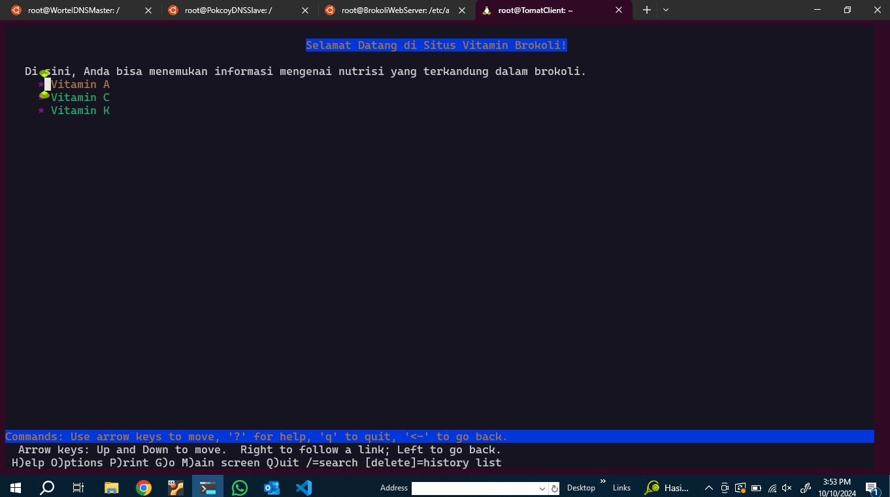

- Explanation

`Untuk menampilkan informasi pada sayur brokoli yang bisa ditampilkan melewati subdomain vitamin.brokoli.a05.com dan server aliasanya juga www.vitamin.brokoli.a05.com di node brokoli, harus membuat document root terlebih dahulu, karena menggunakan Apache Web Server stop nginx dulu agar port nya tidak tabrakan : `

**BrokoliWebServer**

```bash
service nginx stop

# ke root lagi
wget --no-check-certificate --content-disposition "https://docs.google.com/uc?export=download&id=1NhsaTLD4Zk06BZJCqdN_oqoxB3uIg2C7"

unzip vitamin.brokoli.yyy.com

mkdir -p /var/www/vitamin.brokoli.yyy.com

mv vitamin.brokoli.yyy.com/* /var/www/vitamin.brokoli.yyy.com

# untuk permission akses root
chown -R www-data:www-data /var/www/vitamin.brokoli.yyy.com

nano /etc/apache2/sites-enabled/vitamin.brokoli.yyy.com.conf

<VirtualHost *:80>
  ServerAdmin webmaster@localhost
  DocumentRoot /var/www/vitamin.brokoli.yyy.com
  ServerName vitamin.brokoli.a05.com
  ServerAlias www.vitamin.brokoli.a05.com
  ErrorLog ${APACHE_LOG_DIR}/error.log
  CustomLog ${APACHE_LOG_DIR}/access.log combined
</VirtualHost>

# vitamin.conf adalah file konfigurasi wajib untuk apche
nano /etc/apache2/sites-available/vitamin.conf

<VirtualHost *:80>
  ServerAdmin webmaster@localhost
  DocumentRoot /var/www/vitamin.brokoli.yyy.com
  ServerName vitamin.brokoli.a05.com
  ServerAlias www.vitamin.brokoli.a05.com
  ErrorLog ${APACHE_LOG_DIR}/error.log
  CustomLog ${APACHE_LOG_DIR}/access.log combined
</VirtualHost>

# a2ensite ini adalah ln -s yang fungsinya sam seperti nginx
a2ensite vitamin.conf

# reset
service apache2 reload
service apache2 restart
```

`Lakukan pengujian di client menggunakan subdomain : `

**Client**

```bash
lynx vitamin.brokoli.a05.com
lynx www.vitamin.brokoli.a05.com
```

<br>

## Soal 13

> Pada subdomain vitamin.brokoli.yyy.com, terdapat subfolder /nutrisi yang menyediakan informasi tentang berbagai vitamin dalam brokoli, seperti Vitamin A, C, dan K. Aktifkan directory listing untuk folder /nutrisi, dan buatlah rewrite rule di Apache untuk memperbaiki URL agar halaman seperti www.vitamin.brokoli.yyy.com/nutrisi/vitamin_a.php dapat diakses hanya dengan www.vitamin.brokoli.yyy.com/nutrisi/vitamin_a. Pastikan setiap halaman vitamin dapat diakses langsung melalui url yang telah disederhanakan.

> _On the vitamin.brokoli.yyy.com subdomain, there is a /nutrisi subfolder that provides information about various vitamins in brokoli, such as Vitamin A, C, and K. Activate directory listing for the /nutrisi folder, and create a rewrite rule in Apache to fix the URL so that pages like www.vitamin.brokoli.yyy.com/nutrisi/vitamin_a.php can be accessed only with www.vitamin.brokoli.yyy.com/nutrisi/vitamin_a. Make sure each vitamin page can be accessed directly through the simplified url._

**Answer:**

- Screenshot

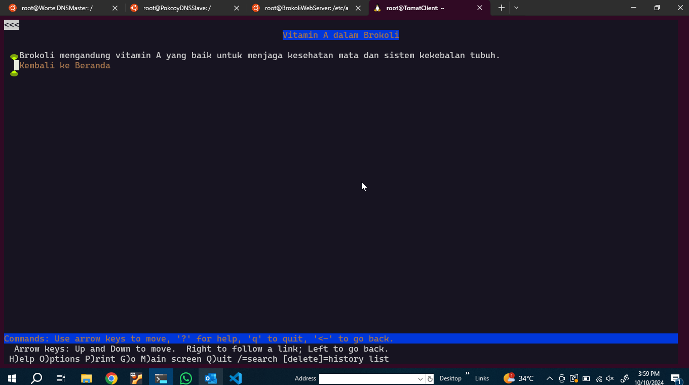

- Explanation

`untuk mengakses nutrisi di dalam resep, Aktifkan Directory Listing untuk Folder /nutrisi, buka file konfigurasi Apache yang terkait dengan domain (misalnya, vitamin.brokoli.a05.com). Cari direktori konfigurasi untuk /nutrisi. Jika belum ada, tambahkan blok berikut di dalam konfigurasi. Buat Rewrite Rule untuk Memperbaiki URL : `

**BrokoliWebServer**

```bash
  nano /etc/apache2/sites-enabled/vitamin.brokoli.yyy.com.conf

<VirtualHost *:80>
  ServerAdmin webmaster@localhost
  DocumentRoot /var/www/vitamin.brokoli.yyy.com
  ServerName vitamin.brokoli.a05.com
  ServerAlias www.vitamin.brokoli.a05.com
  ErrorLog ${APACHE_LOG_DIR}/error.log
  CustomLog ${APACHE_LOG_DIR}/access.log combined
<Directory /var/www/vitamin.brokoli.yyy.com>
        Options Indexes FollowSymLinks
        AllowOverride All
        Require all granted
    </Directory>

  RewriteEngine On
  RewriteCond %{REQUEST_FILENAME} !-d
  RewriteRule ^([^\.]+)$ $1.php [NC,L]

  ErrorLog ${APACHE_LOG_DIR}/error.log
  CustomLog ${APACHE_LOG_DIR}/access.log combined
</VirtualHost>

# fumgsi untuk menulis domain a2enmod untuk mengakses /folder
a2enmod rewrite
service apache2 restart
```

`Untuk testing di client`

**Client**

```bash
lynx vitamin.brokoli.a05.com
lynx www.vitamin.brokoli.a05.com
enter 
enter
```

<br>

## Soal 14

> Tambahkan alias untuk folder /public/images/ pada subdomain www.vitamin.brokoli.yyy.com agar folder tersebut dapat diakses langsung melalui url www.vitamin.brokoli.yyy.com/img.

> _Add an alias for the /public/images/ folder on the www.vitamin.brokoli.yyy.com subdomain so that the folder can be accessed directly through the url www.vitamin.brokoli.yyy.com/img._

**Answer:**

- Screenshot

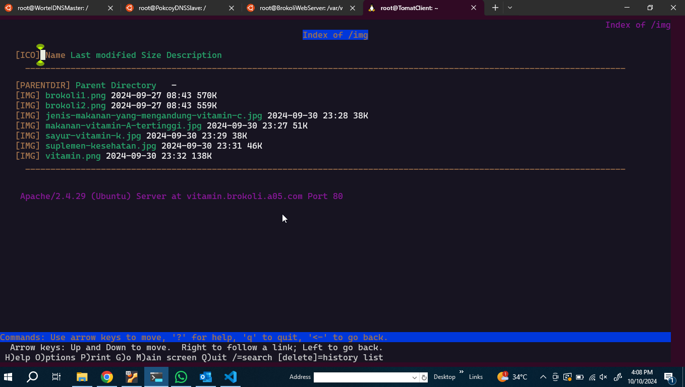

- Explanation

Tambahkan alias untuk folder /public/images/:
Tambahkan alias untuk folder /public/images/ pada subdomain www.vitamin.brokoli.a05.com agar folder tersebut dapat diakses melalui URL www.vitamin.brokoli.a05.com/img dengan membuka file konfigurasi Apache untuk domain, lalu tambahkan baris berikut:

**BrokoliWebServer**

```bash
nano /etc/apache2/sites-enabled/vitamin.brokoli.yyy.com.conf

<VirtualHost *:80>
  ServerAdmin webmaster@localhost
  DocumentRoot /var/www/vitamin.brokoli.yyy.com
  ServerName vitamin.brokoli.a05.com
  ServerAlias www.vitamin.brokoli.a05.com
  ErrorLog ${APACHE_LOG_DIR}/error.log
  CustomLog ${APACHE_LOG_DIR}/access.log combined
<Directory /var/www/vitamin.brokoli.yyy.com>
        Options Indexes FollowSymLinks
        AllowOverride All
        Require all granted
    </Directory>

  # RewriteEngine On
  # RewriteCond %{REQUEST_FILENAME} !-d
  # RewriteRule ^([^\.]+)$ $1.php [NC,L]
  <Directory /var/www/vitamin.brokoli.yyy.com/public/images>
        Options Indexes FollowSymLinks
        AllowOverride None
        Require all granted
  </Directory>

### INILAH POINT NYA DOMAIN ALIAS NYA
 Alias "/img" "/var/www/vitamin.brokoli.yyy.com/public/images"

  ErrorLog ${APACHE_LOG_DIR}/error.log
  CustomLog ${APACHE_LOG_DIR}/access.log combined
</VirtualHost>


service apache2 restart
```

`Setelah langkah-langkah ini, folder /public/images/ akan dapat diakses melalui URL www.vitamin.brokoli.a05.com/img : `

**Client**

```bash
lynx vitamin.brokoli.a05.com/img
lynx www.vitamin.brokoli.a05.com/img
```

<br>

## Soal 15

> Karena terdapat resep rahasia di file /secret/recipe_secret.txt pada subdomain www.vitamin.brokoli.yyy.com, konfigurasikan folder /secret agar tidak dapat diakses oleh pengguna (dengan menampilkan 403 Forbidden).

> _Because there is a secret recipe in the /secret/recipe_secret.txt file on the www.vitamin.brokoli.yyy.com subdomain, configure the /secret folder so that it cannot be accessed by users (by displaying 403 Forbidden)._

**Answer:**

- Screenshot

  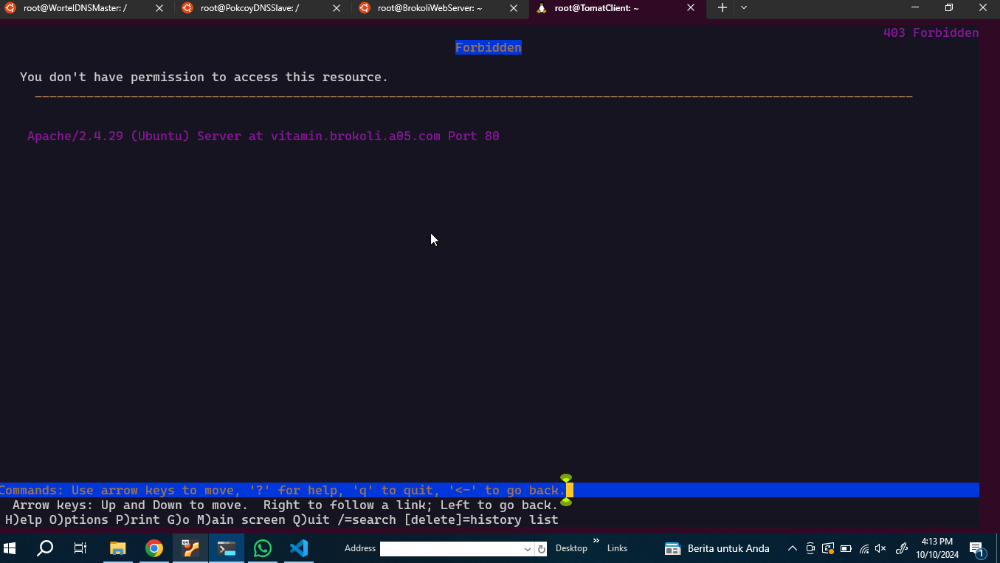

- Explanation

Karena terdapat resep rahasia di file /secret/recipe_secret.txt pada subdomain www.vitamin.brokoli.a05.com, konfigurasikan folder /secret agar tidak dapat diakses oleh pengguna dengan menampilkan pesan 403 Forbidden, dengan menambahkan baris berikut ke dalam file konfigurasi Apache:


**BrokoliWebServer**

```bash
nano /etc/apache2/sites-enabled/vitamin.brokoli.yyy.com.conf

<VirtualHost *:80>
  ServerAdmin webmaster@localhost
  DocumentRoot /var/www/vitamin.brokoli.yyy.com
  ServerName vitamin.brokoli.a05.com
  ServerAlias www.vitamin.brokoli.a05.com
  ErrorLog ${APACHE_LOG_DIR}/error.log
  CustomLog ${APACHE_LOG_DIR}/access.log combined
<Directory /var/www/vitamin.brokoli.yyy.com>
        Options Indexes FollowSymLinks
        AllowOverride All
        Require all granted
    </Directory>

  # RewriteEngine On
  # RewriteCond %{REQUEST_FILENAME} !-d
  # RewriteRule ^([^\.]+)$ $1.php [NC,L]
  <Directory /var/www/vitamin.brokoli.yyy.com/public/images>
        Options Indexes FollowSymLinks
        AllowOverride None
        Require all granted
  </Directory>

  <Directory /var/www/vitamin.brokoli.yyy.com/secret>
          Options -Indexes
  </Directory>

# INI ALIAS NYA
Alias "/secret" "/var/www/vitamin.brokoli.yyy.com/secret"
###

 Alias "/img" "/var/www/vitamin.brokoli.yyy.com/public/images"

  ErrorLog ${APACHE_LOG_DIR}/error.log
  CustomLog ${APACHE_LOG_DIR}/access.log combined
</VirtualHost>


service apache2 restart
```

`Dengan konfigurasi ini, akses ke folder /secret akan diblokir, dan pengguna yang mencoba mengaksesnya akan melihat pesan 403 Forbidden. lakukan di client :`


**Client**

```bash
lynx vitamin.brokoli.a05.com/secret
lynx www.vitamin.brokoli.a05.com/secret
```

<br>

## Soal 16

> Karena dinilai terlalu panjang coba ubah konfigurasi www.vitamin.brokoli.yyy.com/public/js menjadi www.vitamin.brokoli.yyy.com/js

> _Since it is considered too long, change the configuration from www.vitamin.brokoli.yyy.com/public/js to www.vitamin.brokoli.yyy.com/js._

**Answer:**

- Screenshot

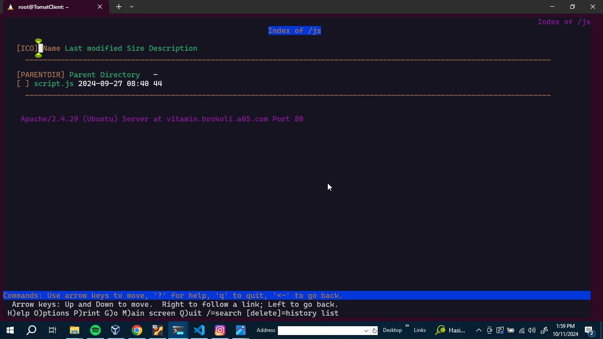

- Explanation

`Karena dinilai terlalu panjang, ubah konfigurasi agar folder www.vitamin.brokoli.a05.com/public/js dapat diakses melalui URL yang lebih singkat www.vitamin.brokoli.a05.com/js dengan menambahkan alias berikut pada file konfigurasi Apache: `

**BrokoliWebServer**

```bash
nano /etc/apache2/sites-enabled/vitamin.brokoli.yyy.com.conf

<VirtualHost *:80>
  ServerAdmin webmaster@localhost
  DocumentRoot /var/www/vitamin.brokoli.yyy.com
  ServerName vitamin.brokoli.a05.com
  ServerAlias www.vitamin.brokoli.a05.com
  ErrorLog ${APACHE_LOG_DIR}/error.log
  CustomLog ${APACHE_LOG_DIR}/access.log combined
<Directory /var/www/vitamin.brokoli.yyy.com>
        Options Indexes FollowSymLinks
        AllowOverride All
        Require all granted
    </Directory>

  # RewriteEngine On
  # RewriteCond %{REQUEST_FILENAME} !-d
  # RewriteRule ^([^\.]+)$ $1.php [NC,L]
  <Directory /var/www/vitamin.brokoli.yyy.com/public/images>
        Options Indexes FollowSymLinks
        AllowOverride None
        Require all granted
  </Directory>

  <Directory /var/www/vitamin.brokoli.yyy.com/secret>
          Options -Indexes
  </Directory>

<Directory /var/www/vitamin.brokoli.yyy.com/public/js>
        Options Indexes FollowSymLinks
        AllowOverride None
        Require all granted
  </Directory>

# INI ALIAS NYA
Alias "/js" "/var/www/vitamin.brokoli.yyy.com/public/js"
###

Alias "/secret" "/var/www/vitamin.brokoli.yyy.com/secret"

 Alias "/img" "/var/www/vitamin.brokoli.yyy.com/public/images"

  ErrorLog ${APACHE_LOG_DIR}/error.log
  CustomLog ${APACHE_LOG_DIR}/access.log combined
</VirtualHost>


service apache2 restart
```

`Dengan demikian, folder public/js akan dapat diakses melalui URL yang lebih pendek www.vitamin.brokoli.a05.com/js. Lakukan di client : `

**Client**

```bash
lynx vitamin.brokoli.a05.com/js
lynx www.vitamin.brokoli.a05.com/js
```

<br>

## Soal 17

> Supaya Web kita aman terkendali maka ubah konfigurasi www.k1.vitamin.brokoli.yyy.com menjadi hanya bisa di akses oleh port 9696 dan 8888

> _To keep our web secure, configure www.k1.vitamin.brokoli.yyy.com to only be accessible through ports 9696 and 8888._

**Answer:**

- Screenshot

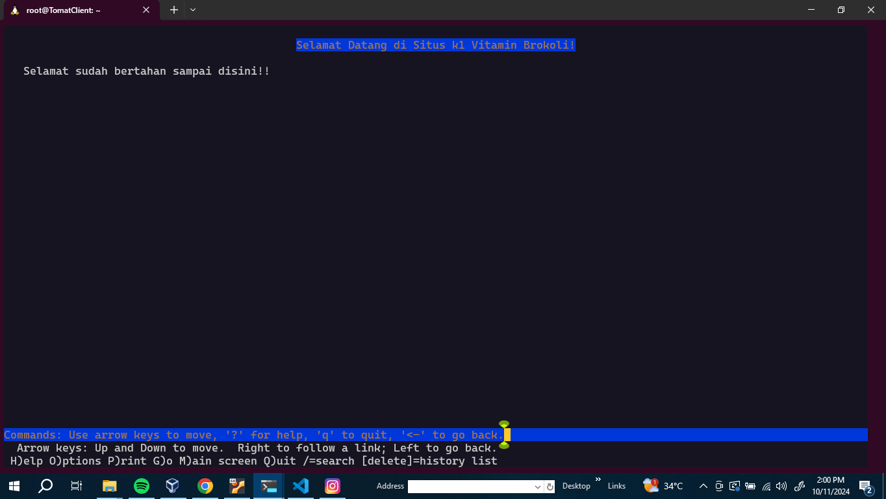

- Explanation

`Untuk mengonfigurasi agar web www.k1.vitamin.brokoli.a05.com hanya bisa diakses melalui port 9696 dan 8888, buka file konfigurasi Apache untuk subdomain tersebut, kemudian tambahkan konfigurasi <VirtualHost *:9696 *:8888> yang mencakup ServerName www.k1.vitamin.brokoli.a05.com, DocumentRoot path ke vitamin.brokoli.a05.com/k1, dan mengatur akses direktori dengan Require all granted`

**BrokoliWebServer**

```bash
wget --no-check-certificate --content-disposition "https://docs.google.com/uc?export=download&id=1SRnelY4XrtmhJg_Ly1nUJo1Jf91SnmtB"

unzip k1.vitamin.brokoli.yyy.com.zip


mkdir -p /var/www/k1.vitamin.brokoli.yyy.com

mv k1.vitamin.brokoli.yyy.com/* /var/www/k1.vitamin.brokoli.yyy.com

chown -R www-data:www-data /var/www/k1.vitamin.brokoli.yyy.com


nano /etc/apache2/sites-available/k1.vitamin.brokoli.a05.com.conf

<VirtualHost *:9696 *:8888>
  ServerAdmin webmaster@localhost
  DocumentRoot /var/www/k1.vitamin.brokoli.yyy.com
  ServerName k1.vitamin.brokoli.a05.com
  ServerAlias www.k1.vitamin.brokoli.a05.com

<Directory /var/www/k1.vitamin.brokoli.yyy.com>
        Options Indexes FollowSymLinks
        AllowOverride All
        Require all granted
  </Directory>
  ErrorLog ${APACHE_LOG_DIR}/error.log
  CustomLog ${APACHE_LOG_DIR}/access.log combined
</VirtualHost>

nano /etc/apache2/ports.conf 

# tambahkan port 9696 dan 8888

Listen 80
Listen 9696
Listen 8888

<IfModule ssl_module>
        Listen 443
</IfModule>

<IfModule mod_gnutls.c>
        Listen 443
</IfModule>

a2ensite k1.vitamin.brokoli.a05.com.conf
service apache2 reload
service apache2 restart
```


`Sehingga web hanya dapat diakses melalui kedua port yang telah ditentukan. Lakukan di client : `

**Client**

```bash
lynx k1.vitamin.brokoli.a05.com:9696
lynx www.k1.vitamin.brokoli.a05.com:9696
lynx k1.vitamin.brokoli.a05.com:8888
lynx www.k1.vitamin.brokoli.a05.com:8888
```

<br>

## Soal 18

> Lanjutkan dari nomor sebelumnya buatlah autentikasi dengan username “Seblak” dan password “sehatyyy” dengan yyy adalah kode kelompok. Letakkan Document Root pada /var/www/k1.vitamin.brokoli.yyy.

> _Continuing from the previous point, create authentication with the username “Seblak” and the password “sehatyyy” where yyy is the group code. Set the Document Root to /var/www/k1.vitamin.brokoli.yyy._

**Answer:**

- Screenshot

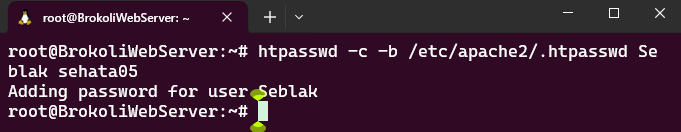

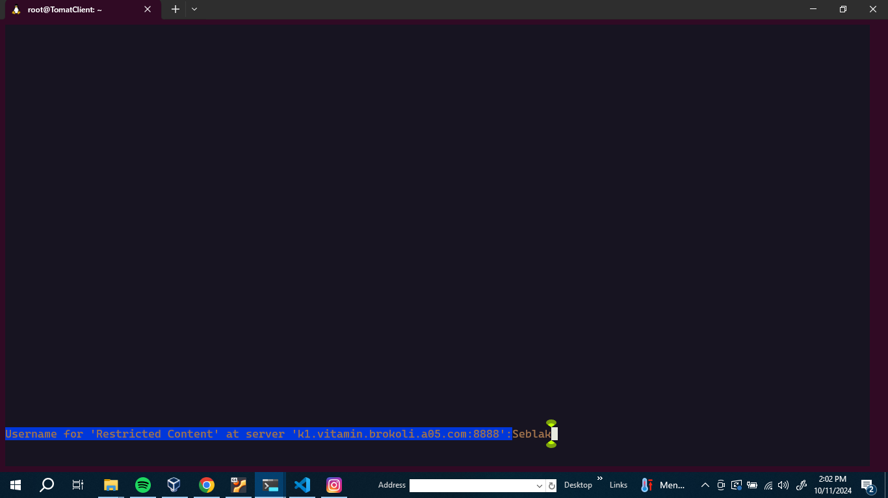

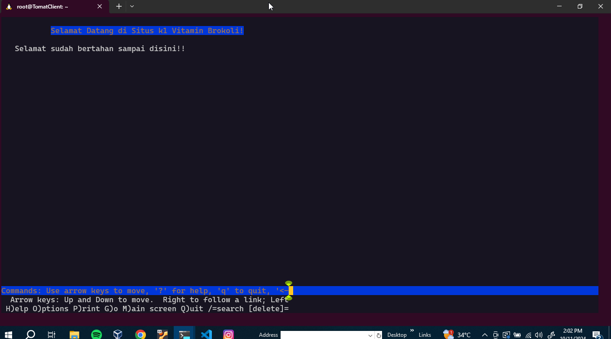

- Explanation

`Untuk membuat autentikasi dengan username "Seblak" dan password "sehata05" (di mana "a05" adalah kode kelompok) pada web www.k1.vitamin.brokoli.a05.com, dan meletakkan Document Root pada /var/www/k1.vitamin.brokoli.a05, perlu melakukan beberapa langkah. Pertama, buat file .htpasswd untuk menyimpan informasi pengguna. Gunakan perintah berikut di terminal htpasswd -c -b /etc/apache2/.htpasswd Seblak sehata05 :`


**BrokoliWebServer**

```bash
htpasswd -c -b /etc/apache2/.htpasswd Seblak sehata05

nano  /etc/apache2/sites-available/k1.vitamin.brokoli.a05.com.conf

<VirtualHost *:80>
  ServerAdmin webmaster@localhost
  DocumentRoot /var/www/k1.vitamin.brokoli.yyy.com
  ServerName k1.vitamin.brokoli.a05.com
  ServerAlias www.k1.vitamin.brokoli.a05.com

<Directory /var/www/k1.vitamin.brokoli.yyy.com>
        Options Indexes FollowSymLinks
        AllowOverride All
        Require all granted
  </Directory>

 <Directory /var/www/k1.vitamin.brokoli.yyy.com>
          AuthType Basic
          AuthName "Restricted Content"
          AuthUserFile /etc/apache2/.htpasswd
          Require valid-user
  </Directory>
  ErrorLog ${APACHE_LOG_DIR}/error.log
  CustomLog ${APACHE_LOG_DIR}/access.log combined
</VirtualHost>


service apache2 restart
```

`Sehingga saat web diakses melalui kedua port yang telah ditentukan. sebelum login akan dimintai username dan password. Lakukan di client : `


**Client**

```bash
lynx k1.vitamin.brokoli.a05.com
lynx www.k1.vitamin.brokoli.a05.com
```

<br>

## Soal 19

> Konfigurasikan agar setiap kali IP Brokoli diakses dengan lynx, secara otomatis akan dialihkan ke www.brokoli.yyy.com (alias).

> _Configure it so that every time Brokoli's IP is accessed using lynx, it is automatically redirected to www.brokoli.yyy.com (alias)._

**Answer:**

- Screenshot

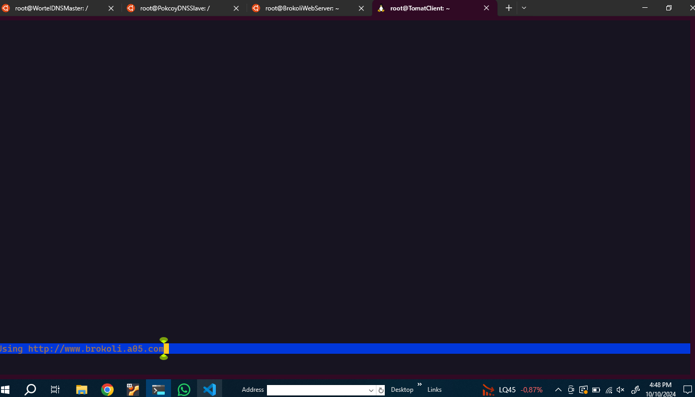

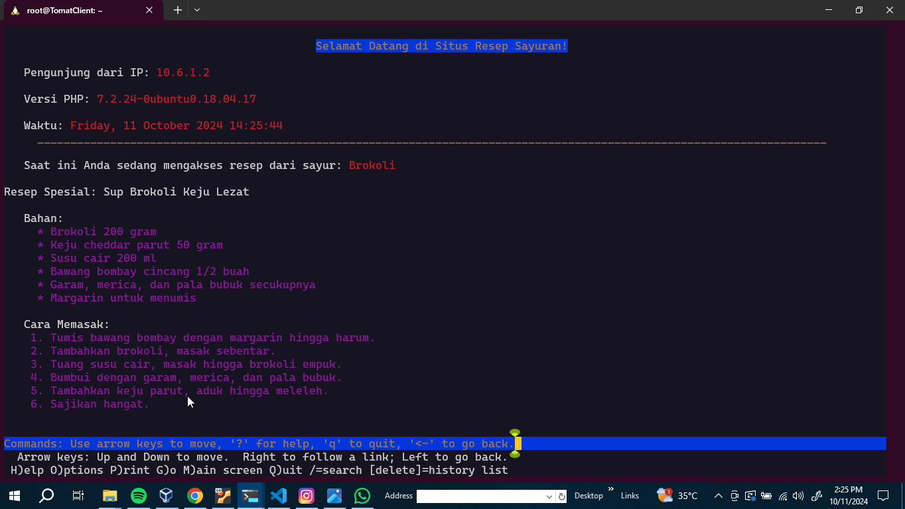

- Explanation

Untuk mengonfigurasi agar setiap kali IP server Brokoli diakses menggunakan lynx, pengguna secara otomatis akan dialihkan ke www.brokoli.a05.com, perlu menambahkan pengaturan di file konfigurasi Apache. Buka file konfigurasi untuk server atau virtual host yang sesuai, lalu tambahkan blok berikut di dalamnya:

**BrokoliWebServer**

```bash
nano /etc/apache2/sites-available/000-default.conf

<VirtualHost *:80>
  ServerAdmin webmaster@localhost
  DocumentRoot /var/www/brokoli.a05.com

  ServerName brokoli.a05.com
  ServerAlias www.brokoli.a05.com

  RewriteEngine On

  RewriteCond %{HTTP_HOST} ^10\.6\.3\.3$
  RewriteRule ^(.*)$ http://www.brokoli.a05.com/$1 [L,R=301]

</VirtualHost>

a2enmod rewrite
service apache2 restart
```

`Dengan konfigurasi ini, setiap kali pengguna mengakses IP Brokoli menggunakan lynx, mereka akan dialihkan secara otomatis ke www.brokoli.a05.com : `

**Client**
```bash
lynx 10.6.3.3
```

<br>

## Soal 20

> Karena jumlah pengunjung website www.vitamin.brokoli.yyy.com semakin meningkat dan terdapat banyak gambar random, ubah permintaan gambar yang mengandung substring "vitamin" agar diarahkan ke file vitamin.png.

> _Since the number of visitors to www.vitamin.brokoli.yyy.com is increasing and there are many random images, redirect image requests that contain the substring "vitamin" to the file vitamin.png._

**Answer:**

- Screenshot

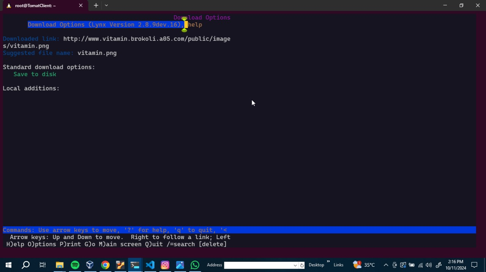
  

- Explanation

`Untuk mengarahkan permintaan gambar yang mengandung substring "vitamin" ke file vitamin.png di website www.vitamin.brokoli.a05.com, buka file .htaccess yang terletak di root direktori website atau tambahkan aturan di dalam blok virtual host pada konfigurasi Apache. Kemudian, tambahkan aturan berikut:`

**BrokoliWebServer**

```bash

echo -e '
<VirtualHost *:80>
  ServerAdmin webmaster@localhost
  DocumentRoot /var/www/vitamin.brokoli.yyy.com
  ServerName vitamin.brokoli.a05.com
  ServerAlias www.vitamin.brokoli.a05.com

<Directory /var/www/vitamin.brokoli.yyy.com>

RewriteEngine On
RewriteCond %{REQUEST_URI} \.(jpg|png)$ [NC]
RewriteCond %{REQUEST_URI} vitamin [NC]
RewriteCond %{REQUEST_URI} !^/public/images/vitamin\.png [NC]
RewriteRule ^(.*)$ http://www.vitamin.brokoli.a05.com/public/images/vitamin.png
  </Directory>


<Directory /var/www/vitamin.brokoli.yyy.com/secret>
          Options -Indexes
  </Directory>

Alias "/secret" "/var/www/vitamin.brokoli.yyy.com/secret"
  ErrorLog ${APACHE_LOG_DIR}/error.log
  CustomLog ${APACHE_LOG_DIR}/access.log combined
</VirtualHost>' > /etc/apache2/sites-enabled/vitamin.brokoli.a05.com.conf

a2enmod rewrite
service apache2 restart


echo -e '
<Directory /var/www/vitamin.brokoli.yyy.com> 
RewriteCond %{REQUEST_URI} \.(jpg|png)$ [NC] 
RewriteCond %{REQUEST_URI} vitamin [NC]
RewriteCond %{REQUEST_URI} !^/public/images/vitamin\.png
</Directory>
'> /var/www/vitamin.brokoli.yyy.com/.htaccess

a2enmod rewrite
service apache2 restart
```

`Catatan: Pastikan untuk menjalankan service apache2 restart setelah mengubah konfigurasi. setiap permintaan untuk gambar yang mengandung substring "vitamin" akan secara otomatis diarahkan ke file vitamin.png karena di dalam file .htaccess ada rewite condition sebagai domain alias untuk mengases vitamin.png di dalam folder public/images . Lakukan di client : `

**Client**

```bash
lynx www.vitamin.brokoli.a05.com/public/images/vitamin.png
lynx www.vitamin.brokoli.a05.com/public/images/not-vitamin.jpg
```

<br>
  
## Problems

Dari segi soal sudah aman tak ada kendala yang terlalu serius dan sudah mungkin hanya dibagian soal php nginx beserta apache yang harus diinstal satu satu dan restart stop sana-sini agar tidak akses denied.Ada lagi yaitu sering lupa buat save code dan documentasi sehingga apabila terjadi perubahan code suka lupa + backtracking ke code sebelumnya. GNSnya juga lemot instalasinya juga lama, suka putus-putus dan jika terputus wifi harus install ulang dan lamaaaa banget .Overal keren banget buat Asdos penguji mas Razan Atallah juga keren makasih banyak. Sekian terima kasih.


## Revisions (if any)

Revisi bagian nomer 12-20, di praktikum awalnya konfigurasi sudah benar hanya saja jika dijalankan ulang akan membuat nomer sebelumnya juga error dan untuk screenshoot nomer 12-20 sebenrnya sudah benar namun lupa melakukan screenshoot karena awalnya ragu apakah benar output nya seperti itu.# Jarkom-2-j24-a05
